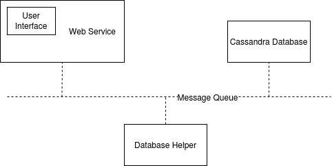

# README

## Prerequisites

- docker
- docker compose

## How to build

1. Copy your machine's IP address

On Linux OS (eth0/ens33)

```sh
ifconfig
```

On Windows OS (IPv4 Address)

```sh
ipconfig
```

2. Edit `mushroom_classifier.env`, replace `127.0.0.1` with your machine's IP address

```sh
redis_host_ip=127.0.0.1
redis_port=6379
db_host_ip=127.0.0.1
db_port=9042
web_host_ip=127.0.0.1
web_port=5000
```

## How to run

On the same directory, run `docker-compose build`, then `docker-compose run`.

**Note:** when run `docker-compose run`, please allow a waiting time of **10** to **20** seconds for the system to boot up. This is because one of the containers requires another container to be running. 

Open your web browser, in the url bar, type `http://<machine_ip_address>:5000/`.

## How to run tests

```sh
docker exec -it mushroomclassifier_test bash
```

### Modular Tests

```sh
root@<hash>:/app# pytest user_login.py
```

```sh
root@<hash>:/app# pytest user_register.py
```

```sh
root@<hash>:/app# pytest classify.py
```

```sh
root@<hash>:/app# pytest prediction_history.py
```

### Integration Tests

```sh
root@<hash>:/app# pytest *.py
```

## Tools/Technologies

### Jupyter Notebook

```sh
conda install numpy
conda install pandas
conda install matplotlib
conda install scikit-learn
```

#### How to view notebook

- Navigate to `notebook` directory
- In your terminal or command prompt, type `jupyter notebook`.
- Open `mushroom_classification_march_2020.ipynb` file

### Technologies

#### Client
HTML, Jquery, Bootstrap

#### Server

##### API middleware
Flask

#### Message Queue
Redis

#### Database
Cassandra is a distributed database from Apache that is highly scalable and designed to manage very large amounts of structured data. It provides high availability with no single point of failure.

#### Model
Logistic Regression

## Software Diagram



Redis message queue connects Database, Database helper and Web Service containers. This follows a microservice arhictecture.

#### Security

- Cassandra database query is using prepared statements for securing against SQL based injection attacks
- Sanitizing jquery user input helps to defend against cross side scripting attacks and tamper data attacks which an add-on for Firefox that lets you view and modify HTTP requests before they are sent.

## Tasks

### Classifier
- [x] pre-train a mushroom classifier

### Frontend:
- [x] allow users to specify properties of a mushroom
- [x] output poisonous or eatable based on request to backend

### Backend
- [x] create a REST API to determine the class of a mushroom based on input data
- [x] use pre-trained classifier to classify mushroom eatability based on input

### Optional Tasks
- [x] Backend: unit tests
- [x] Backend: integration tests
- [ ] General: Build in CI/CD Pipeline
- [x] General: Build and deploy using Docker / Kubernetes

### Optional Features
#### History
- [x] Backend: store / provide history of classifications
- [x] Frontend: display past predictions
#### User Management
- [x] Backend: add user management
- [x] Frontend: add login & user management
#### Validation
- [x] Frontend: perform input validation before submitting
- [x] Backend: return errors for invalid input data
- [x] Frontend: output warnings based on backend error